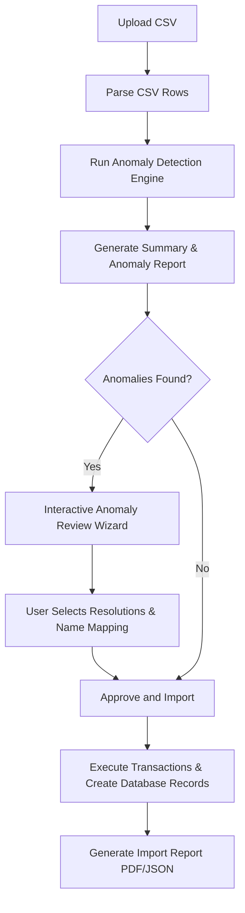
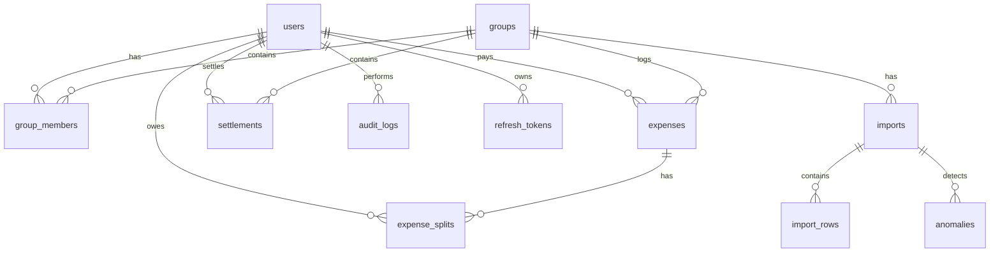

# Project Scope & Database Schema

## Detected Anomalies & Resolutions

| # | Anomaly Type | CSV Example / Row | Severity | Handling / Resolution Policy |
|---|---|---|---|---|
| 1 | **Duplicate expenses** | Rows 5 & 6 (Marina Bites) | High | User is prompted to: 1) **Merge** (import only one row, skip duplicate) or 2) **Keep Both** (import as separate transactions). |
| 2 | **Near duplicate expenses** | Rows 24 & 25 (Thalassa Dinner) | Medium | Flags row if date is within 2 days, payer is same, amount is similar. User decides to merge or keep. |
| 3 | **Negative amount** | Row 26 (Refund -30 USD) | Medium | Flags as a negative amount. Treated as a refund split (inverting split values into negative balances). |
| 4 | **Missing payer** | Row 13 (Blank payer field) | Critical | Import blocked until user assigns a registered group member as the payer. |
| 5 | **Missing participant** | Row 14 (Settlement has empty split_with) | High | If Split Type is empty, flags as a settlement, mapping it to the settlements table. |
| 6 | **Invalid currency** | Row 28 (Empty currency field) | High | Defaults currency to INR or allows mapping to USD. |
| 7 | **Settlement logged as expense** | Row 14 ("Rohan paid Aisha back") | Medium | User resolves by mapping to the settlements module rather than logging it as an expense. |
| 8 | **Invalid date format** | Row 27 ("Mar-14") | Low | Parsed robustly using Month-Day pattern (defaulting to current year 2026), and standardized. |
| 9 | **Expense outside membership period** | Row 36 (Groceries with Meera after March 31) | High | Flags warning. Member is excluded from split share on that date, or transaction date adjusted. |
| 10| **Split mismatch** | Row 15 (Pizza Friday 110% percentage) | High | Sums must equal 100% (percentage) or total amount (unequal). Wizard normalizes splits. |
| 11| **Unknown member** | Row 11 ("Priya S") / Row 23 ("Kabir") | High | Wizard allows user to map misspelled names (e.g. "Priya S" -> "Priya") or register new users. |
| 12| **Unsupported split type** | Split type not equal, percentage, share, or unequal | High | Defaults to "equal" split type. |
| 13| **Empty amount** | Row 31 (Swiggy order ₹0) | Medium | Flags zero or empty amount. User approves if zero-value is intentional or deletes. |
| 14| **Future date** | Date in future | Medium | Prompts user to adjust date to a present/past timestamp. |
| 15| **Impossible exchange rate** | USD to INR outside range 50-120 | High | Allows manual entry of correct current rate. |

---

## Import Flow Diagram

---

## Database ER Diagram

---

## Database Schema Structure

### 1. `users`
- `id` UUID PRIMARY KEY
- `name` VARCHAR
- `email` VARCHAR UNIQUE
- `password_hash` VARCHAR
- `created_at` TIMESTAMP

### 2. `groups`
- `id` UUID PRIMARY KEY
- `name` VARCHAR
- `description` TEXT
- `created_at` TIMESTAMP

### 3. `group_members`
- `id` UUID PRIMARY KEY
- `group_id` UUID REFERENCES groups(id)
- `user_id` UUID REFERENCES users(id)
- `joined_at` TIMESTAMP
- `left_at` TIMESTAMP (Can be NULL)

### 4. `expenses`
- `id` UUID PRIMARY KEY
- `group_id` UUID REFERENCES groups(id)
- `title` VARCHAR
- `description` TEXT
- `original_amount` NUMERIC
- `original_currency` VARCHAR
- `exchange_rate` NUMERIC
- `converted_amount_in_inr` NUMERIC
- `expense_date` TIMESTAMP
- `paid_by` UUID REFERENCES users(id)
- `split_type` VARCHAR
- `created_at` TIMESTAMP

### 5. `expense_splits`
- `id` UUID PRIMARY KEY
- `expense_id` UUID REFERENCES expenses(id)
- `user_id` UUID REFERENCES users(id)
- `split_value` NUMERIC
- `owed_amount_in_inr` NUMERIC

### 6. `settlements`
- `id` UUID PRIMARY KEY
- `group_id` UUID REFERENCES groups(id)
- `payer_id` UUID REFERENCES users(id)
- `receiver_id` UUID REFERENCES users(id)
- `amount` NUMERIC
- `currency` VARCHAR
- `exchange_rate` NUMERIC
- `converted_amount_in_inr` NUMERIC
- `settlement_date` TIMESTAMP
- `note` TEXT

### 7. `anomalies`
- `id` UUID PRIMARY KEY
- `import_id` UUID REFERENCES imports(id)
- `row_number` INT
- `severity` VARCHAR
- `type` VARCHAR
- `description` TEXT
- `suggested_action` TEXT
- `status` VARCHAR
- `decision` VARCHAR
- `fixed_data` JSONB
